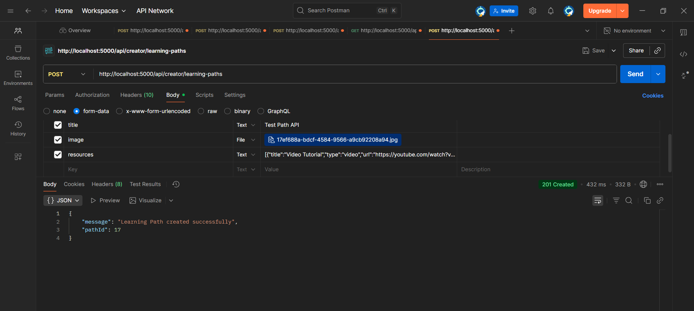
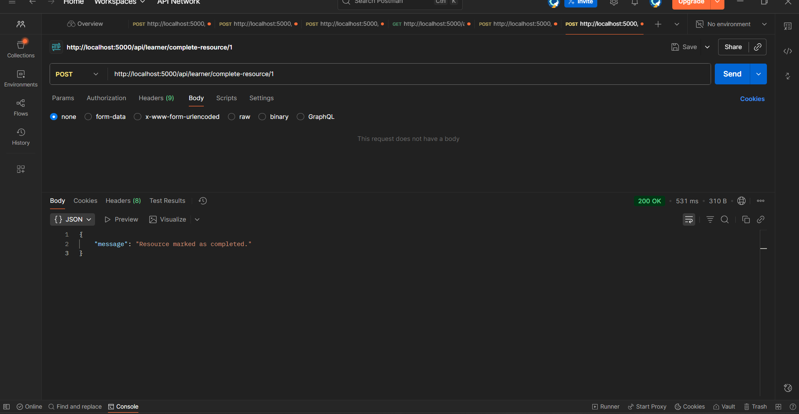
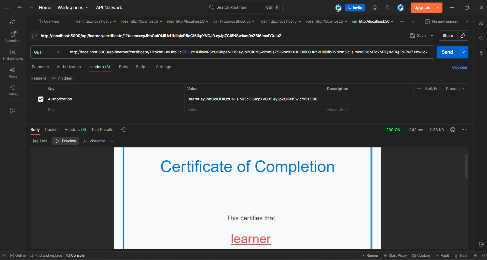

# Backend API Testing Results

## Test Environment
- Base URL: http://localhost:5000/api
- Testing Tool: Postman

## Test 1: Path Creation API
**Endpoint:** POST /creator/learning-paths

**Test Case:** Create a new learning path with resources

**Request:**
- Headers: Authorization, Content-Type
- Body: title, image, resources array

**Expected Response:** 
- Status: 201 Created
- Returns: Path object with ID and all details

**Actual Result:** ✅ PASS
- Status: 201
- Response: Successfully created path with ID 15

**Screenshot:** 

---

## Test 2: Progress Update API
**Endpoint:** POST /learner/progress

**Test Case:** Mark a resource as completed

**Request:**
```json
{
  "resource_id": 1,
  "is_completed": true
}
```

**Expected Response:**
- Status: 200 OK
- Progress updated in database

**Actual Result:** ✅ PASS
- Status: 200
- Database updated successfully

**Screenshot:** 

---

## Test 3: Certificate Generation API
**Endpoint:** GET /learner/certificate/:pathId

**Test Case:** Generate PDF certificate for completed path

**Request:**
- Path ID: 1
- Authorization token

**Expected Response:**
- Status: 200 OK
- Content-Type: application/pdf
- PDF file downloads

**Actual Result:** ✅ PASS
- Status: 200
- Certificate downloaded successfully
- Contains learner name and path title

**Screenshot:** 

---

## Summary
- Total Tests: 3
- Passed: 3
- Failed: 0
- Success Rate: 100%

All critical backend APIs are functioning correctly.