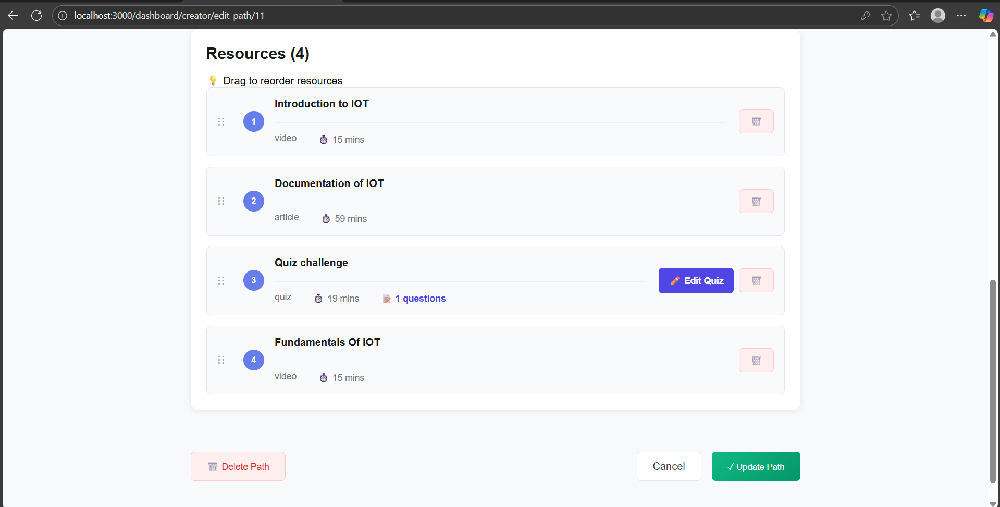
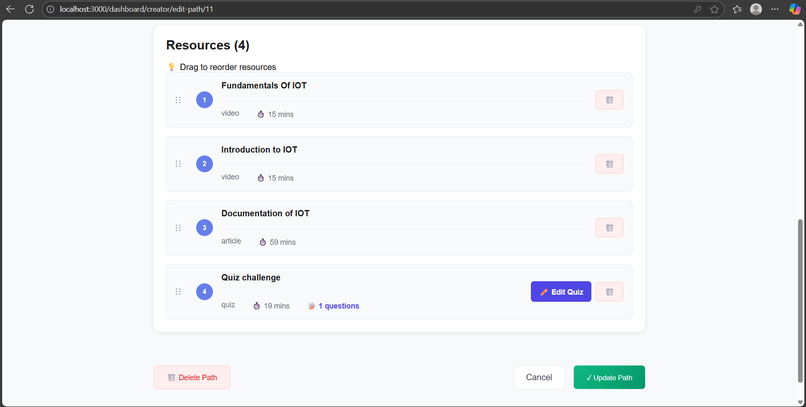
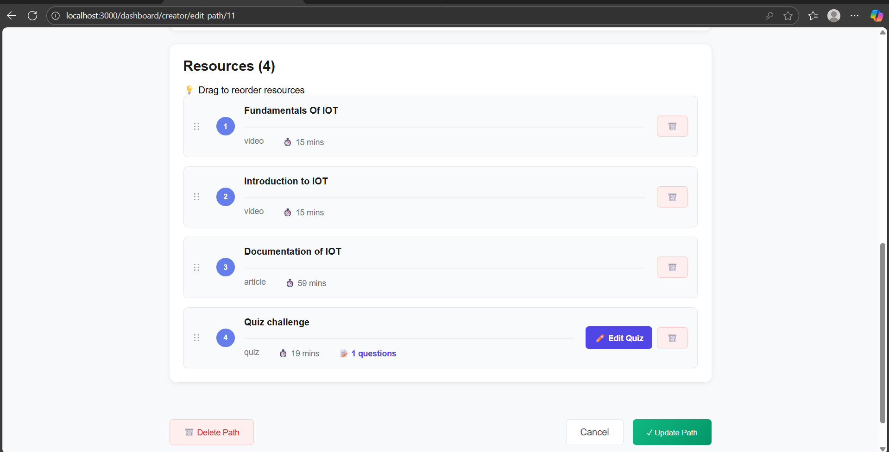
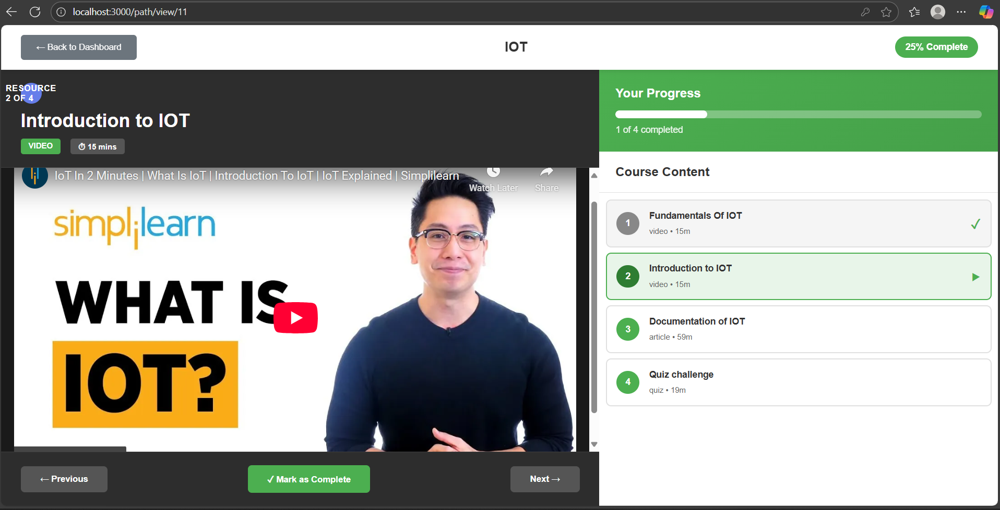
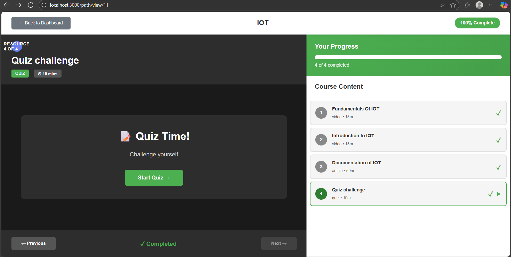

# Frontend Testing Results

## Test 1: Drag-and-Drop Persistence

**Feature:** Resource reordering in path creation

**Test Steps:**
1. Navigate to Edit Path page (Path ID: 12)
2. Initial order: Resource A, B, C, D
3. Dragged Resource D to position 1
4. New order: D, A, B, C
5. Clicked "Update Path"
6. Navigated back to dashboard
7. Reopened same path for editing

**Expected Result:**
- Resources should appear in NEW order (D, A, B, C)
- Order should persist after page refresh

**Actual Result:** ✅ PASS
- Resources maintained the reordered sequence
- Order persisted correctly in database
- Drag-and-drop functionality working as expected

**Screenshots:**
- Before drag: 
- After drag: 
- After refresh: 

---

## Test 2: Progress Visualization

**Feature:** Progress bar updates as learner completes resources

**Test Steps:**
1. Login as learner
2. Enroll in "Complete Java Bootcamp" path (5 resources)
3. Initial progress: 0%
4. Complete Resource 1 → Progress: 25%
5. Complete Resource 2 → Progress: 50%
6. Complete Resource 3 → Progress: 75%
7. Complete Resource 4 → Progress: 100%

**Expected Result:**
- Progress bar updates after each completion
- Percentage calculated correctly
- Visual feedback is immediate
- Certificate option appears at 100%

**Actual Result:** ✅ PASS
- Progress bar updated in real-time
- Calculation: (completed/total) × 100 = accurate
- Green progress bar fills proportionally
- Certificate download button appeared at 100%

**Screenshots:**
- 25% progress: 
- 50% progress: 
- 100% progress with certificate: 

---

## Summary
- Total Frontend Tests: 2
- Passed: 2
- Failed: 0
- Success Rate: 100%