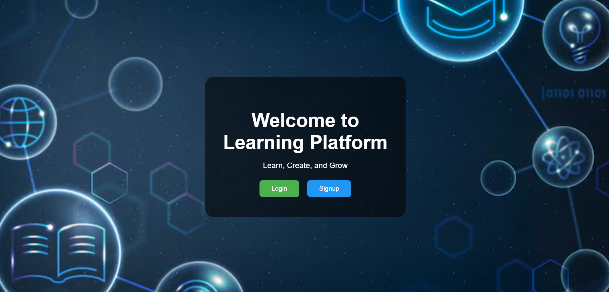

# Learning Path Platform

A comprehensive web application that enables users to create, manage, and follow personalized learning paths. Creators can build courses with videos, articles, and quizzes, while learners can explore content, track progress, and earn certificates upon completion. The platform features role-based authentication for Admin, Creator, and Learner users.

---

## Table of Contents

- [Features](#features)
- [Development Process](#development-process)
- [Challenges and Solutions](#challenges-and-solutions)
- [Screenshots](#screenshots)
- [Deployment](#deployment)
- [Technologies Used](#technologies-used)
- [Installation](#installation)

---

## Features

### For Creators
- Create and manage learning paths with custom titles and cover images
- Add multiple resource types: videos (YouTube embeds), articles, and interactive quizzes
- Drag-and-drop reordering of resources for optimal learning flow
- Toggle path visibility between public and private
- Preview paths before publishing
- Edit existing paths and resources
- Track resource count and estimated completion time

### For Learners
- Browse and discover public learning paths
- Register for courses and track enrollment
- Interactive learning experience with:
  - Embedded video playback
  - Article reading with external links
  - Quiz assessments with instant feedback
- Real-time progress tracking with visual indicators
- Mark resources as complete
- Earn certificates upon 100% course completion
- Download certificates as PDF
- View all earned certificates in dedicated page

### For Admins
- Comprehensive dashboard with user and path statistics
- Manage all users (view, delete)
- Manage all learning paths (view, delete)
- Monitor platform activity

### General Features
- Secure role-based authentication (JWT)
- Responsive design for mobile and desktop
- Modern, intuitive UI with smooth animations
- Real-time notifications and feedback
- Certificate generation with custom designs

---

## Development Process

### 1. Frontend Development
- **Framework:** React.js with React Router for navigation
- **Key Pages:**
  - Authentication (Login/Signup with role selection)
  - Creator Dashboard (path management with cards)
  - Learner Dashboard (course discovery and progress tracking)
  - Admin Dashboard (user and path management)
  - Path Viewer (interactive learning interface)
  - Certificate Gallery (earned certificates display)
- **Features Implemented:**
  - Drag-and-drop with `react-beautiful-dnd` for resource ordering
  - Form validation for path and resource creation
  - Quiz builder with multiple-choice questions
  - Progress bars and completion tracking
  - PDF certificate download functionality
  - Image upload for learning path covers

### 2. Backend Development
- **Framework:** Node.js with Express.js
- **Database:** PostgreSQL with connection pooling
- **API Architecture:** RESTful endpoints
- **Key Features:**
  - JWT-based authentication with role verification
  - Middleware for route protection
  - File upload handling with Multer
  - Certificate generation with PDFKit
  - Quiz scoring and validation
  - Progress tracking with database transactions
  - Automatic certificate issuance on course completion

### 3. Database Schema
- **Users:** Role-based (admin, creator, learner) with encrypted passwords
- **Learning Paths:** Title, description, image, creator, visibility
- **Resources:** Videos, articles, quizzes with order and estimated time
- **Questions & Options:** Quiz structure with correct answer tracking
- **Learner Progress:** Completion tracking per resource
- **Certificates:** Issued certificates with timestamps
- **Enrollments:** Learner-path registration tracking

### 4. Integration
- Connected frontend and backend via Axios
- Implemented API utility with base URL configuration
- Role-based routing and navigation guards
- Error handling with user-friendly messages
- Loading states and optimistic UI updates

---

## Challenges and Solutions

| Challenge | Solution |
|-----------|----------|
| **Admin role security** | Removed "Admin" from signup dropdown; admin users created via direct database insertion |
| **YouTube video embedding** | Converted YouTube URLs to embed format (`/embed/VIDEO_ID`) for proper iframe display |
| **Progress persistence** | Implemented `LearnerProgress` table with JOIN queries to fetch completion status |
| **Resource reordering** | Used `react-beautiful-dnd` with order field in database for persistent ordering |
| **Certificate generation** | Integrated PDFKit to generate professional certificates with course and user details |
| **Quiz completion tracking** | Added transaction logic to mark resources complete AND check for path completion |
| **Scroll issues in modals** | Applied CSS overflow properties and height constraints to enable scrolling |
| **Image preview on upload** | Used FileReader API to show image preview before upload |
| **Drag-drop in edit mode** | Maintained resource state with temporary IDs for both existing and new resources |
| **Certificate automation** | Implemented automatic certificate issuance when learner completes 100% of resources |

---

## Screenshots


*Modern landing page with role-based signup*


*Creator dashboard showing learning paths with statistics*


*Learner dashboard with course recommendations and progress*


*Admin panel for user and path management*


*Home page with platform overview*


*Interactive learning interface with progress tracking*


*Certificate gallery showing earned achievements*

---

## Technologies Used

### Frontend
- **React.js** - UI framework
- **React Router** - Navigation and routing
- **Axios** - HTTP client for API calls
- **react-beautiful-dnd** - Drag and drop functionality
- **CSS3** - Custom styling with gradients and animations

### Backend
- **Node.js** - Runtime environment
- **Express.js** - Web framework
- **PostgreSQL** - Relational database
- **JWT** - Authentication tokens
- **bcrypt** - Password hashing
- **Multer** - File upload handling
- **PDFKit** - Certificate generation

### DevOps
- **Docker** - Containerization
- **Docker Compose** - Multi-container orchestration
- **Git** - Version control

---

## Installation

### Prerequisites
- Node.js (v14 or higher)
- PostgreSQL (v12 or higher)
- npm or yarn package manager

### Local Setup

1. **Clone the repository**
```bash
git clone <repository-url>
cd learning-path-platform
```

2. **Setup Backend**
```bash
cd server
npm install

# Create .env file
touch .env
```

Add to `.env`:
```env
PORT=5000
DB_HOST=localhost
DB_PORT=5432
DB_USER=your_db_user
DB_PASSWORD=your_db_password
DB_NAME=learning_path_db
JWT_SECRET=your_jwt_secret_key
```

3. **Setup Database**
```bash
# Connect to PostgreSQL
psql -U postgres

# Create database
CREATE DATABASE learning_path_db;

# Run migrations (if available) or create tables manually
# Tables: Users, LearningPaths, Resources, Questions, Options, 
#         LearnerProgress, Certificates, LearnerLearningPaths
```

4. **Setup Frontend**
```bash
cd ../client
npm install

# Create .env file
touch .env
```

Add to `.env`:
```env
REACT_APP_API_URL=http://localhost:5000/api
```

5. **Start Development Servers**
```bash
# Terminal 1 - Backend
cd server
npm start

# Terminal 2 - Frontend
cd client
npm start
```

6. **Access Application**
- Frontend: http://localhost:3000
- Backend API: http://localhost:5000

---

## Deployment

### Using Docker

1. **Ensure Docker and Docker Compose are installed**

2. **Build and run containers**
```bash
docker-compose build
docker-compose up
```

3. **Access the application**
- Application will be available at configured port
- Database will run in a separate container

### Manual Deployment

**Backend (Node.js):**
- Deploy to services like Heroku, Render, or AWS
- Set environment variables
- Ensure PostgreSQL database is accessible

**Frontend (React):**
- Build production bundle: `npm run build`
- Deploy to Vercel, Netlify, or serve via Nginx
- Update API URL environment variable

---

## API Endpoints

### Authentication
- `POST /api/auth/signup` - Register new user
- `POST /api/auth/login` - User login

### Creator Routes
- `GET /api/paths/mypaths` - Get creator's paths
- `GET /api/creator/paths/:pathId` - Get single path for editing
- `POST /api/creator/learning-paths` - Create new path
- `PUT /api/creator/learning-paths/:pathId` - Update path
- `DELETE /api/creator/learning-paths/:pathId` - Delete path
- `PUT /api/creator/paths/:pathId/visibility` - Toggle public/private

### Learner Routes
- `GET /api/learner/learning-paths` - Get available paths
- `POST /api/learner/register-path` - Register for a path
- `GET /api/paths/view/:pathId` - View path details
- `POST /api/learner/complete-resource/:id` - Mark resource complete
- `GET /api/learner/quiz/:resourceId` - Get quiz questions
- `POST /api/learner/quiz/submit` - Submit quiz answers
- `GET /api/learner/my-certificates` - Get earned certificates
- `GET /api/learner/certificate/:pathId` - Download certificate PDF

### Admin Routes
- `GET /api/admin/users` - Get all users
- `DELETE /api/admin/users/:userId` - Delete user
- `GET /api/admin/paths` - Get all paths
- `DELETE /api/admin/paths/:pathId` - Delete path

---
